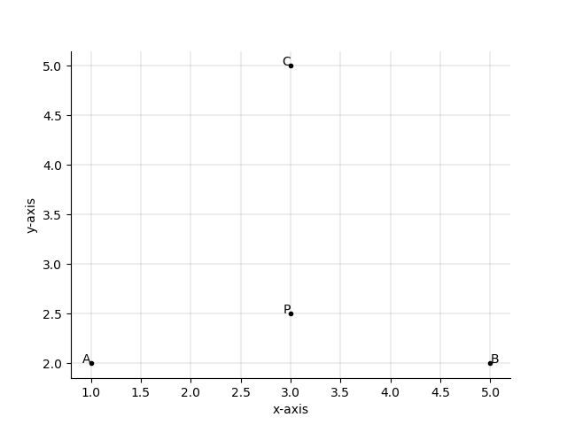
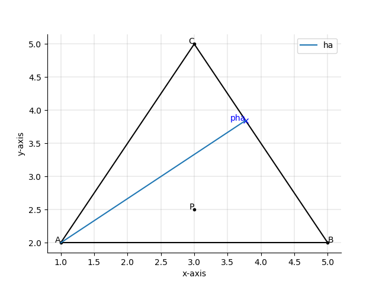
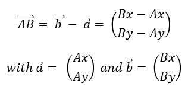
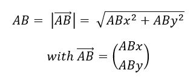
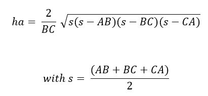
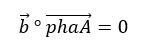
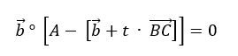
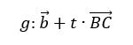
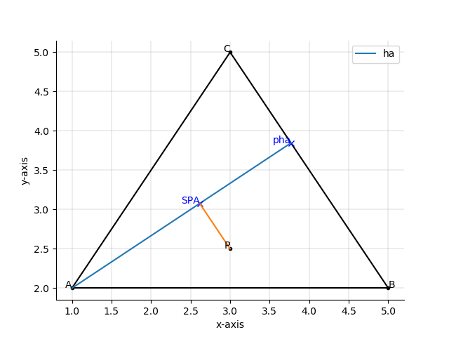

# 2019-end-member-mixing-analyis
### Python 3.7.2, JetBrains PyCharm Community Edition 2018.3.5
This python project is part of the master thesis “Abflussseparation mittels stabiler Isotopen – Bestimmung der Wasserherkunft nach Regen, Schnee- und Gletscherschmelze in drei alpinen Einzugsgebieten” (hydrological separation with stable isotopes – determination of the water origin regarding rain, glacier and snowmelt in three alpine catchments). The master thesis is embedded in a research project of the hydropower company Kraftwerke Oberhasli AG (KWO) and the University of Bern. 
Further information about the background of the project is available in the **Report_ EMMA.pdf**.

Author: Noemi Buri, noemi.buri@students.unibe.ch, University of Bern, Seminar Geodata Analysis and Modelling 2019

## Goal
The goal of this script is to test a set of data regarding its suitability for conducting an end-member-mixing-analysis (EMMA). Therefore, the mixing triangle is shown such that the user can check, whether the investigated sample is within the triangle. If this is the case, the percentages of the three different water origins is given. Further information about the EMMA is given in the **Report_EMMA.pdf**. Vector calculations are used to solve the EMMA. If you want to perform a principle component analysis before doing the EMMA you have to do it before using this script.

## Workflow
The following part describes the workflow of the script. The code is stored in the function "emma".
### 1. Import
Firstly, the packages numpy, math, sympy and matholpot.lib.pyplot are installed.
### 2. Define triangle
For each of the three components a two-dimensional vector is created. Component A consists of the elements Ax and Ay which build vector A. Components B and C are handled the same way. This data sets the corners of the mixing triangle. Furthermore, the investigated sample P for which the mixing calculation is done, is generated. In *Figure 1* you can see a visualization of this step.

*Figure 1 : components A, B and C and mixing sample P*

As next the mixing triangle gets defined. Therefore, the vector direction and magnitude of the triangle sides are calculated. The vector sides are named AB, BC and CA. For each triangle side the triangle height is assessed, for which the vector direction and magnitude are calculated. The triangle lengths are called ha, hb and hc. The point where the triangle height meets the opposite triangle side is called pha for the component A, phb for the componente B and phc for the component C. The vector directions of the triangle sides are named phaA, phbB and phcC. In *Figure 2* you can see this step of the calculation for the component A.

*Figure 2 : triangle side ha and point pha*

To calculate the vector direction of the triangle sides the following formula is used:

To calculate the vector magnitude the following formula is used:

To calculate the triangle side magnitude the following formula is used:

To calculate the triangle side direction, in the following scalar equation

phaA is replaced with the straight line equation, giving following equation:

whereby the straight line equation is:

### 3. Triangle calculations
In this part the points of intersection of the triangle heights at right angles to point P are calculated. This point is called SPA for the component A (see *Figure 3*), SPB for the component B and SPC for the component C. The vector from point P to point SPA is called SPAP (SPBP for the component B and SPCP for the component C).
As a next step the distance from point SPA to the triangle corner A is calculated. With this distance and the corresponding triangle height the percentage of the component A can be assessed. The same is done for the components B and C.

*Figure 3 : point SPA and line SPAP*

The calculations are perfomed consistent with the formulas shown in section 3.
### 4. Plot
In the final step of the script the mixing triangle is plotted as shown in *Figure 3*. To achieve a clear overview, only the calculation of the component A is visualized. If you wish you can easily add the visualisation of the other components by adding phb, phc, SPB and SPC to the plot. Please be aware that the display of the mixing triangle is not normed. Hence the angles are not shown realistically.
## apply function
To apply the function "emma" you can use following code:

a = emma(Ax, Ay, Bx, By, Cx, Cy, Px, Py)

Therefore, you have to specify your data by giving numbers for  Ax, Ay, Bx, By, Cx, Cy, Px and Py.
## Output
As output of the script you get the visualized mixing triangle as shown in *Figure 3*. Here you can check if your investigated sample (point P) lies within the mixing triangle. If this is not the case, you cannot perform the EMMA. If P lies within the triangle, the percentages of the components A, B and C you get are the result of your EMMA. 
